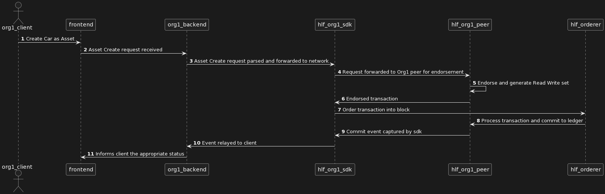
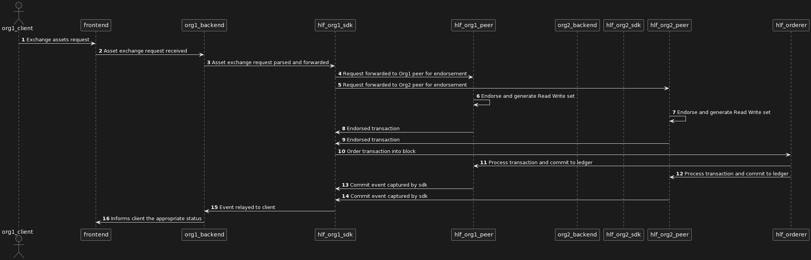

# Design & API Spec

## Transaction Flow

- Query:

- Create:
  

- Update:
  

- Delete:

## Backend API Spec

### Authentication & Authorization

Group: /auth

#### Client

Group: /client

- Login
  Method: POST
  Endpoint: /login
  Payload:

- Logout
  Method: POST
  Endpoint: /logout
  Payload:

- Register
  Method: POST
  Endpoint: /register
  Payload:

#### Admin

Group: /admin

- Login
  Method: POST
  Endpoint: /login
  Payload:

- Logout
  Method: POST
  Endpoint: /logout
  Payload:

- Register
  Method: POST
  Endpoint: /register
  Payload:

### HLF Network Operations

Group: /blockchain

#### Wallet

Group: /wallet

- Create: Create a wallet on HLF network for a user in an organization
  Method: POST
  Endpoint: /
  Payload:

- Update: Update wallet, wallet ownership cannot change
  Method: PATCH
  Endpoint: /
  Payload:

- Delete: Soft delete a wallet and mark it as inactive, it can be reactivated
  Method: DELETE
  Endpoint: /
  Payload:

#### Asset(Car, Digital Currency)

Group: /asset

- Query: Fetch list of assets in a user's wallets, list them by category
  Method: GET
  Endpoint: /
  Payload:

- Create: Create a new asset of given type on HLF network for a user in an organization
  Method: POST
  Endpoint: /
  Payload:

- Update: Update ownership of an asset of given type
  Method: PATCH
  Endpoint: /
  Payload:

- Delete: Soft delete an asset and mark it as inactive, it cannot be reactivated or used for any transaction anymore
  Method: DELETE
  Endpoint: /
  Payload:
